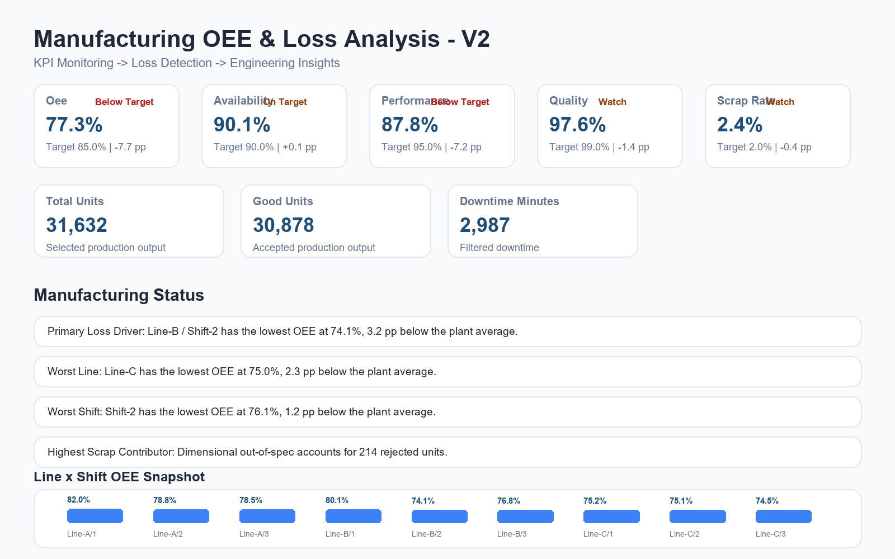
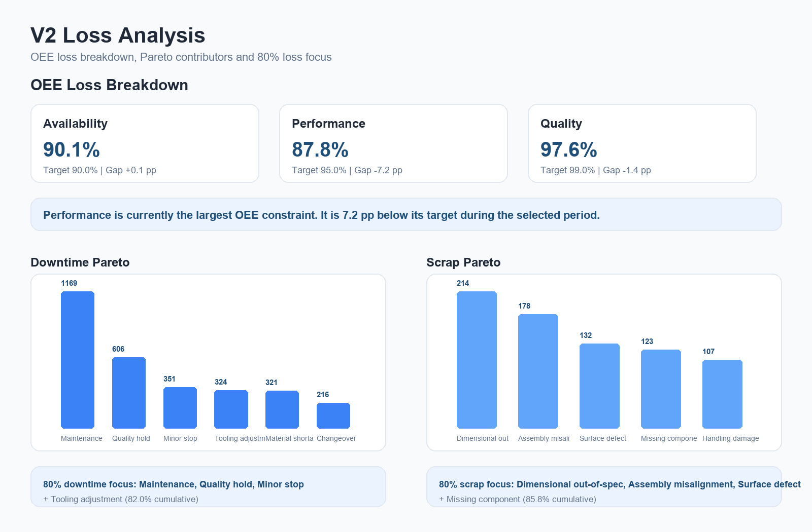
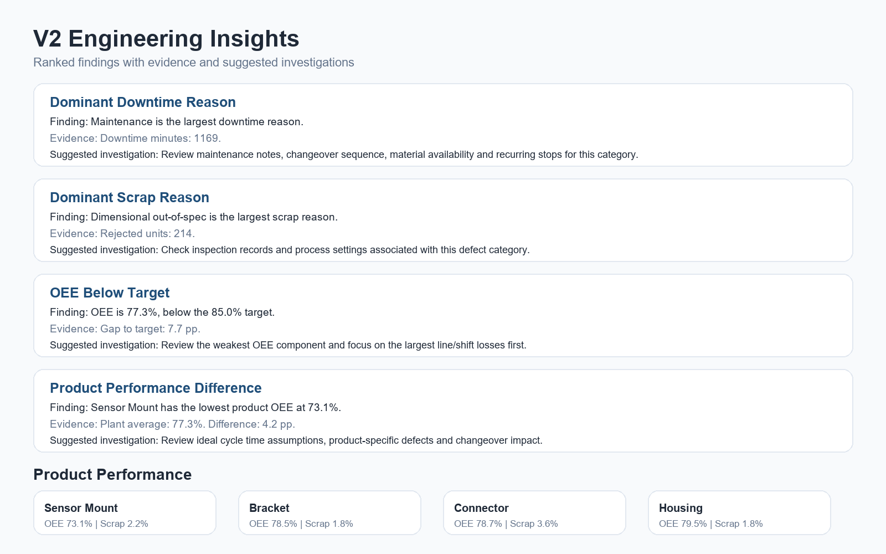

# Manufacturing OEE & Loss Analysis Dashboard

[](https://www.python.org/)
[](https://streamlit.io/)
[](https://www.sqlite.org/)
[](https://docs.pytest.org/)
[](https://doi.org/10.5281/zenodo.21879822)

This project uses synthetic data and was created as a professional portfolio project.

## Technical Paper

**[OEE-Based Manufacturing Loss Diagnostics: A Reproducible Synthetic Case Study](paper/OEE_Based_Manufacturing_Loss_Diagnostics_v1.0.pdf)**

Romulo Colorado, 2026

DOI: [10.5281/zenodo.21879822](https://doi.org/10.5281/zenodo.21879822)

Zenodo record: [https://zenodo.org/records/21879822](https://zenodo.org/records/21879822)

This technical paper documents the methodology, synthetic experimental design, OEE aggregation logic, loss-diagnostic workflow, controlled ground-truth patterns, results, limitations and reproducibility of this project.

The paper accompanies the software implementation contained in this repository. It is a synthetic engineering case study, independently published on Zenodo as a DOI-backed reproducible artifact. It uses IEEE-style formatting, but it is not an IEEE publication and does not claim industrial validation.

## Problem

Manufacturing engineers need to identify where OEE losses originate, whether performance is improving or deteriorating, and which line, shift, product or loss category should be investigated first.

## Solution

This dashboard converts synthetic production, downtime and scrap records into diagnostic engineering information:

```txt
Synthetic Data
  -> SQLite
  -> KPI Engine
  -> Loss Analysis
  -> Engineering Insight Engine
  -> Streamlit Dashboard
```

The tool is designed for entry-level manufacturing, process, quality, production and continuous improvement engineering portfolio use.

## Paper / Software Relationship

```txt
Technical Paper
  <-> Synthetic Experiment
  <-> Python Analysis Modules
  <-> SQLite Data Layer
  <-> Streamlit Engineering Dashboard
```

The paper is the documented engineering analysis and controlled synthetic experiment. This repository is the reproducible software implementation and supporting artifact.

## Engineering Questions Answered

- Are we meeting manufacturing targets?
- Where are we losing OEE?
- Which line, shift, product or loss category is responsible?
- What changed compared with the previous period?
- What should an engineer investigate first?
- What causes approximately 80% of downtime or scrap?
- Did an improvement period actually improve selected KPIs?

## Tech Stack

- Python
- pandas
- Streamlit
- Plotly
- SQLite
- pytest
- CSV / Excel-style data files

## v1.0.0 Features

- Configurable manufacturing targets for OEE, Availability, Performance, Quality and Scrap Rate.
- Executive KPI scorecard with target deltas and previous-period comparison.
- Automatic Manufacturing Status summary based on filtered data.
- OEE Loss Breakdown across Availability, Performance and Quality.
- Line x Shift heatmap with selectable metric.
- Product Performance analysis.
- True Pareto charts with cumulative percentage and 80% reference.
- Deterministic Engineering Insights with suggested investigations.
- Before / After Improvement Analysis.
- Lightweight SPC-style KPI monitoring with daily trends and mean lines.
- SQLite data access layer while preserving CSV files for inspection.
- Synthetic data generator with documented ground-truth patterns.
- Expanded test suite for KPI math, Pareto, periods, insights and data consistency.

## Dataset

The dataset is synthetic and generated by `src/data_generator.py`. It includes:

- Production records by date, line, shift and product
- Downtime events by reason and duration
- Scrap events by defect reason and quantity

No confidential company data is used.

Intentional patterns are documented in [docs/assumptions.md](docs/assumptions.md).

## Reproducibility

The experiment associated with the technical paper is a 30-day synthetic manufacturing case study with:

- 3 production lines
- 3 shifts
- 4 products
- Pseudorandom seed: `42`

Use the following commands to reproduce the dataset and analytics used in the case study:

```bash
pip install -r requirements.txt
python src/data_generator.py --output-dir data --days 30 --seed 42
python src/database.py --data-dir data --db-path data/manufacturing.db
pytest
python -m streamlit run app/dashboard.py
```

## Screenshots

### Dashboard Overview



### Loss Analysis



### Engineering Insights



## How to Run

```bash
pip install -r requirements.txt
python src/data_generator.py --output-dir data --days 30 --seed 42
python src/database.py --data-dir data --db-path data/manufacturing.db
python -m streamlit run app/dashboard.py
```

## How to Run Tests

```bash
pytest
```

## Project Structure

```txt
manufacturing-oee-dashboard/
  README.md
  CHANGELOG.md
  requirements.txt
  data/
    synthetic_production_data.csv
    downtime_events.csv
    scrap_events.csv
    manufacturing.db
  src/
    config.py
    data_generator.py
    database.py
    data_quality.py
    downtime_analysis.py
    engineering_insights.py
    filters.py
    oee_calculator.py
    pareto.py
    scrap_analysis.py
    targets.py
  app/
    dashboard.py
  tests/
    test_data_generator.py
    test_oee_calculator.py
    test_pareto.py
    test_periods_and_insights.py
  docs/
    kpi_definitions.md
    assumptions.md
  paper/
    README.md
    OEE_Based_Manufacturing_Loss_Diagnostics_v1.0.pdf
  assets/
    screenshots/
```

## Interview Summary

I built a manufacturing analytics dashboard that goes beyond KPI visualization. It uses synthetic production, downtime and scrap records to calculate OEE correctly, compare actual performance against engineering targets, detect major losses, rank Pareto contributors and generate deterministic investigation recommendations. The project demonstrates how I would support production and quality teams with data-driven troubleshooting while keeping the dataset reproducible and non-confidential.

## Engineering Notes

- Aggregate OEE is recalculated from summed production values, not averaged from row-level OEE.
- Previous periods are calculated dynamically from the selected date range.
- Recommendations are framed as investigation prompts, not unsupported root-cause claims.
- Cp/Cpk is intentionally excluded because the dataset does not contain legitimate continuous measurements with specification limits.

## Citation

Romulo Colorado, "OEE-Based Manufacturing Loss Diagnostics: A Reproducible Synthetic Case Study," Zenodo, 2026. doi: 10.5281/zenodo.21879822.

```bibtex
@misc{colorado2026oee,
  author       = {Romulo Colorado},
  title        = {OEE-Based Manufacturing Loss Diagnostics: A Reproducible Synthetic Case Study},
  year         = {2026},
  publisher    = {Zenodo},
  doi          = {10.5281/zenodo.21879822},
  url          = {https://doi.org/10.5281/zenodo.21879822}
}
```

## Release

`v1.0.0` corresponds to the published synthetic case study and freezes the reproducible code, synthetic data workflow, dashboard logic and documentation associated with the DOI-backed technical paper.

## Scope

- Synthetic case study only.
- No confidential industrial data is used.
- The project demonstrates reproducibility and engineering loss localization, not industrial validation.
