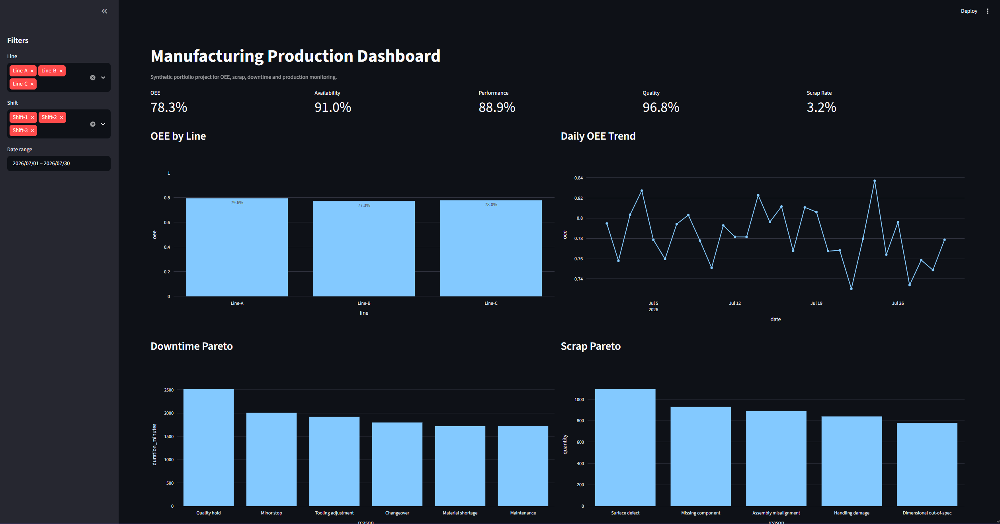
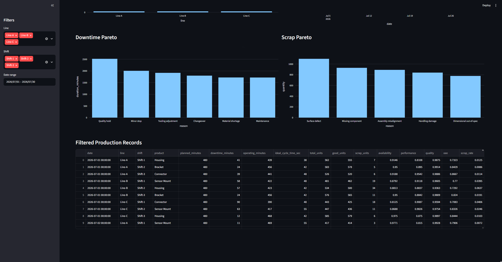

# Manufacturing Production Dashboard: OEE, Scrap and Downtime Analysis

This project uses synthetic data and was created as a professional portfolio project.

## Overview

This project simulates a manufacturing production dashboard for tracking OEE, downtime, scrap and throughput across multiple lines and shifts. It is designed for entry-level manufacturing, process, quality, production and continuous improvement engineering roles.

## Industrial Context

Manufacturing teams need fast visibility into production losses. A junior engineer may be asked to review shift data, calculate KPIs, identify top downtime causes and communicate where improvement work should start. This project demonstrates that workflow using a reproducible synthetic dataset.

## Tech Stack

- Python
- pandas
- Streamlit
- Plotly
- SQLite-ready data layer
- pytest
- CSV / Excel-style data files

## Dataset

The dataset is synthetic and generated by `src/data_generator.py`. It includes:

- Production records by date, line, shift and product
- Downtime events by reason and duration
- Scrap events by defect reason and quantity

No confidential company data is used.

## Features

- Calculates OEE from availability, performance and quality
- Tracks scrap rate, downtime minutes and production output
- Filters by line, shift and date range
- Shows OEE by line and daily OEE trend
- Generates Pareto charts for downtime and scrap reasons
- Includes unit tests for KPI calculations

## Metrics

- OEE
- Availability
- Performance
- Quality
- Scrap rate
- Downtime minutes
- Total units and good units

## Dashboard Preview

### KPI Overview and Pareto Charts



### Filtered Production Records



## How to Run

```bash
pip install -r requirements.txt
python src/data_generator.py --output-dir data
python -m streamlit run app/dashboard.py
```

## How to Run Tests

```bash
pytest
```

## Project Structure

```txt
manufacturing-oee-dashboard/
  README.md
  requirements.txt
  data/
    synthetic_production_data.csv
    downtime_events.csv
    scrap_events.csv
  src/
    data_generator.py
    oee_calculator.py
    downtime_analysis.py
    scrap_analysis.py
    database.py
  app/
    dashboard.py
  tests/
    test_oee_calculator.py
  docs/
    kpi_definitions.md
    assumptions.md
  assets/
    screenshots/
```

## Engineering Decisions

- The data model is intentionally simple so the KPI logic is easy to audit.
- OEE is calculated from production records, while downtime and scrap event tables support Pareto analysis.
- The dashboard focuses on decisions a junior engineer could support: identifying the largest losses, comparing shifts and preparing a clear status summary.

## Interview Summary

I built a manufacturing dashboard with synthetic data to analyze OEE, scrap, downtime and throughput by line and shift. The project demonstrates how I use Python to convert production-style data into engineering KPIs, visual trends and Pareto charts that help prioritize process improvement work.

## Future Improvements

- Add Excel report export
- Add target thresholds and visual alerts
- Add before/after improvement comparison
- Add machine-level traceability
